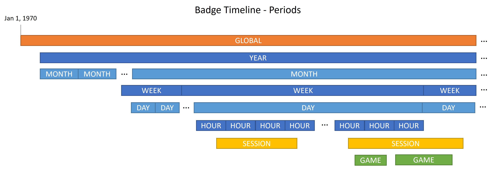

# Badgerific

## Overview

Badgerific is the badges/achievements library for Node.js that you've been looking for. Great for games and app gamification.

## Install

Install the library:

`npm install badgerific --save`

Add it to your JavaScript project:

```js
const Badges = require('badgerific')
const rules = require('./badgeRules.json')

const badges = new Badges(rules);
```


Add it to your TypeScript project:

```ts
import { Badges } from 'badgerific';
import rules from './badgeRules.json';

const badges = new Badges(rules);
```

## Concepts

### Locale

In the constructor, optionally pass the user's time zone which is used for time-based rules. Default is 'UTC'.

```ts
const tz = 'America/Phoenix';
const badges = new Badges(rules, tz);
```

### Data

The data about which badges were earned and the current state of properties and bookmarks are stored external to the library.

It is important that `badges.setData()` is called before any other method on `badges`.

```js
// set badge data
badges.setData(badgeData);

// get badge data
const data = badges.toJson();
```

### Periods (Timeline)



The periods are:
- **Global** - From January 1, 1970 to present to all future dates.
- **Year** - A year.
- **Month** - A month.
- **Week** - A week. Can span border between months.
- **Day** - A day.
- **Hour** - An hour.
- **Session** - A user's session. Can span border between hours, days, weeks, months, or years. Starts with `badges.startSession()` and ends with `badges.endSession()`.
- **Game** - A game. Can span border between hours, days, weeks, months, or years. Starts with `badges.startGame()` and ends with `badges.endGame()`.

Each time the `badges.evaluate()` method is called, a check is made to determine if any of the time-based periods are starting a new period. For example, is today a new day compared to the last time that `evaluate()` was called. This updates any system properties. See [Rules](#rules).

Each time a new period starts, the ISO 8601 UTC value is stored for the period.

Periods are used in the following ways:
- In a rule to limit the period in which a badge can be earned. Example: this badge can only be earned once per `Period.Game`.
- As a filter to `badges.getEarnedBadges()` to list all badges earned for the current period.

### Rules

Rules are defined as JSON and passed to the constructor. Here is a sample rules file which defines a single rule that can only be earned once and can only be updated once per GLOBAL period.

See a list of [sample rules](docs/RULES.md).

```json
[
    {
        "id": "b01",
        "description": "Playing your first game",
        "active": true,
        "max": 1,
        "updatePeriod": "GLOBAL",
        "condition": "gameCount == 1"
    }
]
```

#### Rule Properties
- **id** (required) - Unique identifier of the rule.
- **active** (required) - Only rules set to `true` are evaluated. This is more of a convenience during developer testing.
- **condition** (required) - Conditional statement(s) to be evaluated. If condition is true, the badge is earned.
- **updatePeriod** (required) - Each badge can be earned only once per period. Value: Global, Year, Month, Week, Day, Hour, Session, Game.
- **max** (optional) - If set, the max times that the badge can be earned. If missing, no maximum.
- **description** (optional) - Internal description of the rule.

#### Rule Condition

The condition is evaluated by [Jexl](https://github.com/TomFrost/Jexl#all-the-details) and can consist of:
- custom property or properties
- system property or properties
- system functions
- operators
- comparisons

The expression must evaluate to `true` or `false`. If a property is used in a condition but it hasn't been defined yet, the expression will evaluate to `false`.

**Custom Properties**

The developer can define any property of type `number`, `boolean`, or `string` by passing the `propName` to `badges.setValue()`, `badges.addValue()` or `badges.subtractValue()`.

```ts
// set a property

badges.setValue('prop1', 1);
badges.setValue('prop2', true);
badges.setValue('prop3', 'test');

badges.addValue('prop4');
badges.addValue('prop5', 1);
badges.addValue('prop6', 2);

badges.subtractValue('prop7');
badges.subtractValue('prop8', 1);
badges.subtractValue('prop9', 2);

// get the value of a property or default
const value = badges.getValue('prop1', 0);
const value = badges.getValue('prop2', false);
const value = badges.getValue('prop3', 'default value');
```
Any of the above methods has a `skipEval` parameter that you can set to `true` to skip the call to `evaluate()`. You would use this in those cases where multiple properties are set at the same time and you only want the evaluation to happen for the last property set/changed.

A rule with the condition of `"gameCount == 1"` would match a property called with `badges.addValue('gameCount')`

**System Properties**

Some properties are defined by the system and can be used in a condition by using the `system.` prefix: `"system.isNewDay"`

Here is a list of system properties:

| Property | Value | Description | Limit |
| -------- | ----- | ----------- | ----- |
| system.isNewYear | boolean | Start of a new year. | Only `true` on first `evaluate()` after a new year. |
| system.isNewMonth | boolean | Start of a new month. | Only `true` on first `evaluate()` after a new month. |
| system.isNewWeek | boolean | Start of a new week. | Only `true` on first `evaluate()` after a new week. |
| system.isNewDay | boolean | Start of a new day. | Only `true` on first `evaluate()` after a new day. |
| system.isNewHour | boolean | Start of a new hour. | Only `true` on first `evaluate()` after a new hour. |
| system.date | string | Date in format: yyyy-MM-dd ex: "2022-07-04" |
| system.time | string | Time in format: HH:mm ex: "18:15" |
| system.dayOfWeek | number | 1-7 (Monday is 1, Sunday is 7) |
| system.isWeekDay | boolean | Is current day Monday - Friday |
| system.isWeekEnd | boolean | Is current day Saturday or Sunday |
| system.lifetimeSessions | number | Number of total sessions. |
| system.lifetimeGames | number | Number of total games. |
| system.isNewSession | boolean | Start of a session. | Only `true` on first `evaluate()` after `startSession()`. The value of `system.sessionStatus` is set to `'STARTED'` |
| system.isSessionEnd | boolean | End of a session. | Only `true` on first `evaluate()` after `endSession()`. The value of `system.sessionStatus` is set to `'ENDED'` |
| system.sessionStatus | string | 'NONE', 'STARTED', 'IN_PROGRESS', 'ENDED' |
| system.isNewGame | boolean | Start of a game. | Only `true` on first `evaluate()` after `startGame()`. The value of `system.gameStatus` is set to `'STARTED'` |
| system.isGameEnd | boolean | End of a game. | Only `true` on first `evaluate()` after `endGame()`. The value of `system.gameStatus` is set to `'ENDED'` |
| system.gameStatus | string | 'NONE', 'STARTED', 'IN_PROGRESS', 'ENDED' |
| system.gameEndReason | string | 'WIN', 'LOSE', 'CANCEL', 'GAME_START' |  


NOTE: The following system properties only return `true` on the first `badges.evaluate()` call when the new period starts: `isNewYear`, `isNewMonth`, `isNewWeek`, `isNewDay`, `isNewHour`. Don't use these in expressions that use other non-time-based properties. Similarly, the following are only set to `true` for the first call to `badges.evaluate()` after a session\game is started\ended: `isNewSession`, `isSessionEnd`, `isNewGame`, `isGameEnd`.

**System Functions**

Here is a list of functions that can be used in conditions. These allow rules based on whether the player has earned another badge.

| Function | Returns | Description |
| -------- | ------ | ----------- |
| badgeCount('b01') | number | How many times the badge has been earned. |
| hasEarnedBadge('b01') | boolean | If the badge has been earned or not. |


#### Rule Evaluation

Rules are only evaluated when the `badges.evaluate()` method is called. In most cases you will not call this method directly. Whenever `badges.setValue()`, `badges.addValue()` or `badges.subtractValue()` is called then `evaluate()` is called unless `true` is passed to the `skipEval` parameter. The `badges.evaluate()` method is also called for `badges.startSession()`, `badges.endSession()`, `badges.startGame()`, `badges.endGame()`.

On evaluation, every active rule is checked even if the condition doesn't include that property. If the `condition` is true, the `updatePeriod` is checked to see if the badge has been earned already since the start of the current period. If it has, then it will not be earned again. Finally, if the rule has set `max` then the count of the times a badge was earned is checked against this max value. If all thoses checks pass, the badge is earned.

### New Time Period

The `onNewTimePeriod` callback is called when a time period (year, month, week, day, hour) has changed. The custom and system properties are passed as parameters. Check `systemProps` to see which time period(s) changed: `isNewYear`, `isNewMonth`, `isNewWeek`, `isNewDay`, `isNewHour`. These values will be true for only the next call to `evaluate()` when the time period has changed and not again until the next time the period changes. 

The parameters to the callback are readonly/frozen so you must use `badges.setValue()`, `badges.addValue()` or `badges.subtractValue()` to change a value. Set the `skipEval` flag to `true` to not trigger extra calls to `evaluate()`.

```ts
badges.onNewTimePeriod = (props: ReadonlyBadgeProperties, systemProps: ReadonlyBadgeProperties) => {
  badges.setValue('prop1', 0, true);
  if (systemProps.time > '17:00') {
    // do something
  }
};
```

NOTE: It is important to understand that `onNewTimePeriod` is not called *at* a specific time (such as the top of the hour) but when the time periods are evaluated and if the period has changed since the last time it was checked.


### Start/End Session
The developer determines what a session is and controls the start and end of that session using `badges.startSession()` and `badges.endSession()`. Calling these methods will cause a call to `evaluate()` to check all badge rules.

The `onSessionStart` and `onSessionEnd` callbacks can be used to see the values of custom and system properties, update those properties or whatever you want when the session starts/ends. The callback happens before the call to `evaluate()`. The parameters to the callback are readonly/frozen so you must use `badges.setValue()`, `badges.addValue()` or `badges.subtractValue()` to change a value. Set the `skipEval` flag to `true` to not trigger extra calls to `evaluate()`.

```ts
badges.onSessionStart = (props: ReadonlyBadgeProperties, systemProps: ReadonlyBadgeProperties) => {
  badges.setValue('prop1', 0, true);
  if (systemProps.time > '17:00') {
    // do something
  }
};
```

```ts
badges.onSessionEnd = (props: ReadonlyBadgeProperties, systemProps: ReadonlyBadgeProperties) => {
  // do something
};
```


### Start/End Game
The developer determines what a game is and controls the start and end of that game using `badges.startGame()` and `badges.endGame()`. Calling these methods will cause a call to `evaluate()` to check all badge rules.

The `onGameStart` and `onGameEnd` callbacks can be used to see the values of custom and system properties, update those properties or whatever you want when the game starts/ends. The callback happens before the call to `evaluate()`. The parameters to the callback are readonly/frozen so you must use `badges.setValue()`, `badges.addValue()` or `badges.subtractValue()` to change a value. Set the `skipEval` flag to `true` to not trigger extra calls to `evaluate()`.

```ts
badges.onGameStart = (props: ReadonlyBadgeProperties, systemProps: ReadonlyBadgeProperties) => {
  badges.setValue('prop1', 0, true);
  if (systemProps.time > '17:00') {
    // do something
  }
};
```
The call to `badges.endGame()` requires a `reason` parameter that can be: `GameEndReason.Win`, `GameEndReason.Lose`, `GameEndReason.Cancel`, `GameEndReason.GameStart`. This `reason` is also passed to `onGameEnd`. The `GameEndReason.GameStart` is set by the system when `badges.startGame()` is called while a game is in progress and `badges.endGame()` wasn't explicitly called.

```ts
badges.onGameEnd = (props: ReadonlyBadgeProperties, systemProps: ReadonlyBadgeProperties, reason: GameEndReason) => {
  // do something
};
```

### Get Earned Badges

To get a list of earned badges, call one of the following:
- `badges.getEarnedBadges()` - all badges earned for this game in a player's lifetime. Same as `badges.getEarnedBadges(Period.Global)`.
- `badges.getEarnedBadges(period: Period)` - all badges earned since the start of the current period of a certain period type. To get all the badges earned for the current, active game call: `badges.getEarnedBadges(Period.Game)`.
- `badges.getEarnedBadges(lastTimestamp: string)` - all badges earned since a specific timestamp is ISO 8601 UTC format.
- `badges.getEarnedBadgesSinceBookmark(name: string)` - all badges earned since a named timestamp bookmark. See [Bookmarks](#bookmarks).

When you call `badges.setValue()`, `badges.addValue()` `badges.subtractValue()`, `badges.startSession()`, `badges.endSession()`, `badges.startGame()`, `badges.endGame()` then any badges earned during that call are returned:

```ts
const earned = badges.setValue('prop1', 'test');

const earned = badges.addValue('prop2');

const earned = badges.subtractValue('prop3');

const earned = badges.startSession('prop3');

const earned = badges.endSession('prop3');

const earned = badges.startGame('prop3');

const earned = badges.endGame('prop3', GameEndReason.Lose);
```

You can also set a callback that will be called whenever a badge is earned:

```ts
badges.onBadgeEarned = (badge: ReadonlyEarnedBadge) => {
  // badge includes: id, lastEarned, count
};
```

### Bookmarks

To get a list of badges starting at a time other than those defined in by a period, use a bookmark. Bookmarks are meant to be temporary and are cleared at the start of each session.

A bookmark is really just a named point in time. Here is an example of how to use a bookmark:

```ts
badges.setBookmark('mark1');

// multiple actions; earn badge(s)

const earned = badges.getEarnedBadgesSinceBookmark('mark1');
```
The value returned when setting a bookmark is the ISO 8601 UTC timestamp.

You can clear a specific bookmark with `badges.clearBookmark('mark1')` or clear all bookmarks with `badges.clearAllBookmarks()`.

### Badge Name and Rewards

The badge system focuses on rules and keeping track of badges earned with associated custom properties. It is recommended that you create a `badges.json` file that includes info such as:

- id - match id in this file with id in `rules.json`
- badge name, description, image URL (UI)
- any rewards (points, credits, coins) that are earned when the badge is earned

This allows you to translate the badge info as needed and keeps it separate from the badge rules.

Here is a sample:

```json
[
  {
    "id": "b01",
    "name": "Let's Go!",
    "description": "Earn this badge by finishing your first game.",
    "imageUrl": "https://example.com/images/b01.png",
    "sortId": "001",
    "credits": "1"
  },
  {
    "id": "b02",
    "name": "New Year’s Eve",
    "description": "Play a game on New Year's Eve.",
    "imageUrl": "https://example.com/images/b02.png",
    "sortId": "002",
    "credits": "3"
  }
]

```

